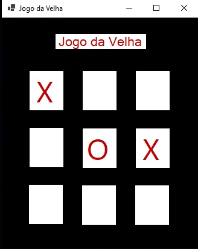

# Jogo Da Velha

## Descrição do Projeto
Desenvolvimento de um jogo da velha utilizando array multi dimensional (matriz).
Exercício de fixação do conteúdo visto em aula durante o curso de técnicas de programação.

> Curos Let's Code, programa Top Coders, Professor Eduardo Júnior

---
## Enunciado

Usando matriz, crie o jogo da velha. Inicialmente, as posições são variáveis vazias. O usuário fornece a linha e a coluna e confirma, então é marcado no tabuleiro X ou O (se for o jogador 1 ou jogador 2).

---

## Conceitos abordados
- Lógica desenvolvida com aplicação do conceito de criação e manipulação de Array;
- Criação do layout com WindowsForms;
- Controle de eventos e propriedades dos objetos de um formulário no WindowsForms;
- Lógica de programação.

--- 
## 🚀 Como executar o programa
- Clonar o repositório em uma pasta local:
    `git clone https://github.com/sergiofdf/JogoDaVelha.git`
  
- Abra a solução do projeto com o visual studio, arquivo `JogoDaVelha.sln`.

- Execute o projeto com `CTRL + F5`

---
## 📲 Apresentação do Projeto

Ilustração do jogo

 

Ilustração da mensagem de vitória.

